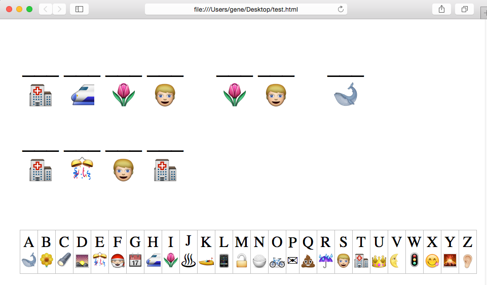

# emojicode
Secret code puzzle generator for kids



## Requirements

1. Working ruby interpreter
2. Browser capable of displaying the emoji character set (like Safari)

## Usage

```
emojicode "This is a test" > output.html
```

Then open `output.html` in your browser and print.

## Bonus feature

Every generated code page is guaranteed to contain 💩  (Pile of Poo).

(if you can't see the Pile of Poo above, you won't see the emoji generated by this script)
